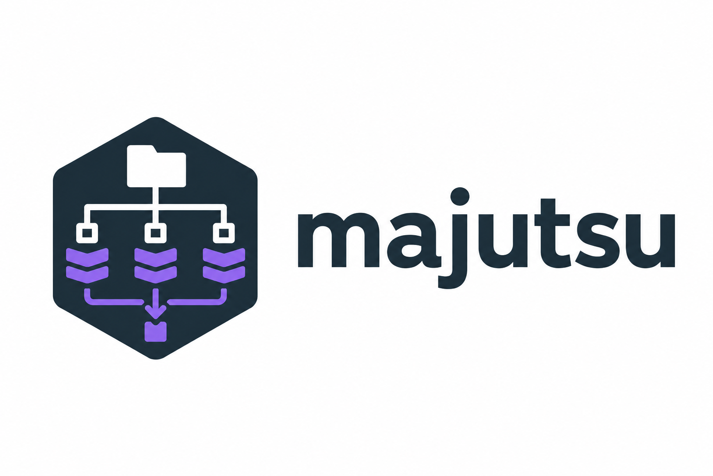

# majutsu

<p align="center">
  
</p>

`majutsu` is a host-level, multi-root snapshot history tool. The installed CLI
command is `mj`.

Majutsu is built for the failure mode that Git and ordinary file sync do not
cover well: a development host loses local state, including uncommitted edits,
service configuration, generated-but-important artifacts, and working files
spread across multiple directories. It records those roots into a local state
home and can continuously protect the data to S3-compatible remote storage.

## Why Majutsu

- Protect several directories from one host-level timeline.
- Preserve uncommitted and non-Git working files, not only repository history.
- Recover from a fresh machine with `mj clone` and `mj restore`.
- Keep a Git/Jujutsu-like operation log for snapshot, daemon, sync, root, and
  restore activity.
- Handle large files through chunk manifests, compression, packing, and
  remote-friendly object layout.
- Run as a user instance or as a separate root-owned system instance for host
  configuration.
- Use S3/GCS-compatible storage, file remotes for local validation, and optional
  object encryption.
- Work on Linux, macOS, and Windows for snapshot, history, sync, clone, and
  materialized restore workflows.

## Install

The recommended install path is the published crates.io package:

```sh
cargo install majutsu
```

This installs the `mj` binary. To install a specific released version:

```sh
cargo install majutsu --version 0.6.3 --locked
```

Use repository-local builds only for development or verification of unreleased
changes:

```sh
cargo install --path .
```

To verify that multiple hosts are running the same build and capability set:

```sh
mj version
mj version --json
```

## Quick Start

For a guided first run, see [Getting Started](docs/GETTING_STARTED.md). The
minimal local flow is:

```sh
mj init
mj root add notes ~/notes
mj snapshot --message 'first snapshot'
mj state -r notes -d
mj state -D -r notes
mj log
mj restore plan --ago 2h --root notes --to /tmp/majutsu-restore
```

To protect a host against local disk loss, configure a remote and run the daemon:

```sh
export AWS_ACCESS_KEY_ID=...
export AWS_SECRET_ACCESS_KEY=...
export AWS_DEFAULT_REGION=ap-northeast-1

mj init --encrypt --remote s3://bucket/prefix
mj root add notes ~/notes
mj snapshot --message 'first remote snapshot'
mj sync --wait
mj daemon start
```

Recovery starts from the remote:

```sh
MAJUTSU_MASTER_KEY=<64-hex-key> mj --home /tmp/recovered clone --remote s3://bucket/prefix
mj --home /tmp/recovered restore apply --to /tmp/restore
```

## What To Read Next

- [Getting Started](docs/GETTING_STARTED.md): first setup, remote backup, daemon,
  and restore check.
- [Features](docs/FEATURES.md): core capabilities and platform support.
- [Command Guide](docs/COMMANDS.md): command groups and daily CLI workflows.
- [Remote And Security](docs/REMOTE_AND_SECURITY.md): S3/GCS-compatible remotes,
  encryption, shared buckets, clone trust, and lifecycle policy.
- [Restore Tutorial](docs/RESTORE_TUTORIAL.md): practical restore examples.
- [Branching](docs/BRANCHING.md): branch and switch workflows for divergent
  timelines.
- [Platform Support](docs/PLATFORM_SUPPORT.md): Linux, macOS, and Windows
  behavior.
- [Operations](docs/OPERATIONS.md): deeper operational reference.
- [Container Demo](docs/CONTAINER_DEMO.md): disposable Podman demo environment.

## Common Workflows

Inspect managed changes since a point in time:

```sh
mj state
mj state 1d
mj state 03:40 -r notes -d
mj state op-123456789abc -g
mj state -D -r notes
mj state --status A,M
mj state -r notes -U --status '?'
mj state -r notes -- docs
mj log
mj log --root notes -- docs
mj note snap-12345678 -m 'before migration'
mj track path/to/file
mj untrack path/to/file
```

Sync, check, and inspect remote state:

```sh
mj sync --wait
mj sync status
mj remote check
mj remote hosts
mj remote fsck
```

Create and inspect restore plans:

```sh
mj restore plan --ago 2h --root notes --to /tmp/restore
mj restore apply --ago 2h --root notes --to /tmp/restore
mj restore mount /tmp/majutsu-view
mj restore unmount /tmp/majutsu-view
```

Keep the daemon visible:

```sh
mj daemon status
mj daemon metrics
mj health
```

## Design Notes

Majutsu stores state under CLI `--home`, `$MAJUTSU_HOME`, XDG config, or
`$HOME/.majutsu` by default. A separate `mj --system` instance can protect
root-owned host configuration under `/etc/majutsu/config.toml` and
`/var/lib/majutsu`.

Each state has a host id. Multiple hosts can share one S3/GCS bucket or prefix;
host metadata is stored under host-scoped paths, while content-addressed payload
objects can be reused when identical data appears across histories. Use separate
prefixes for unrelated trust domains or projects.

For repository internals, see [crates.io release](docs/CRATES_IO_RELEASE.md)
and [release checklist](docs/RELEASE_CHECKLIST.md). The public package is the
root `majutsu` crate; repository-local support crates remain private workspace
boundaries and are mirrored under `src/internal/` for publishing.
